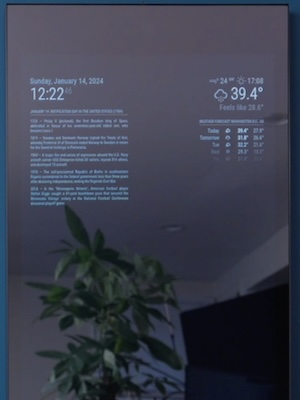
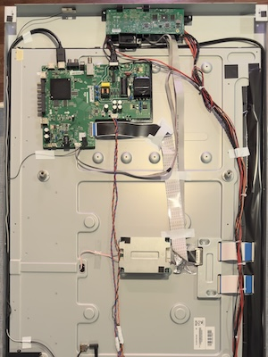
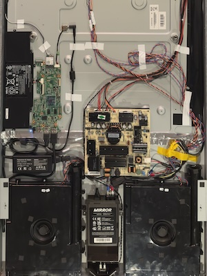
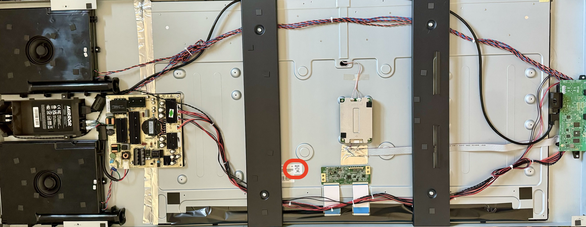
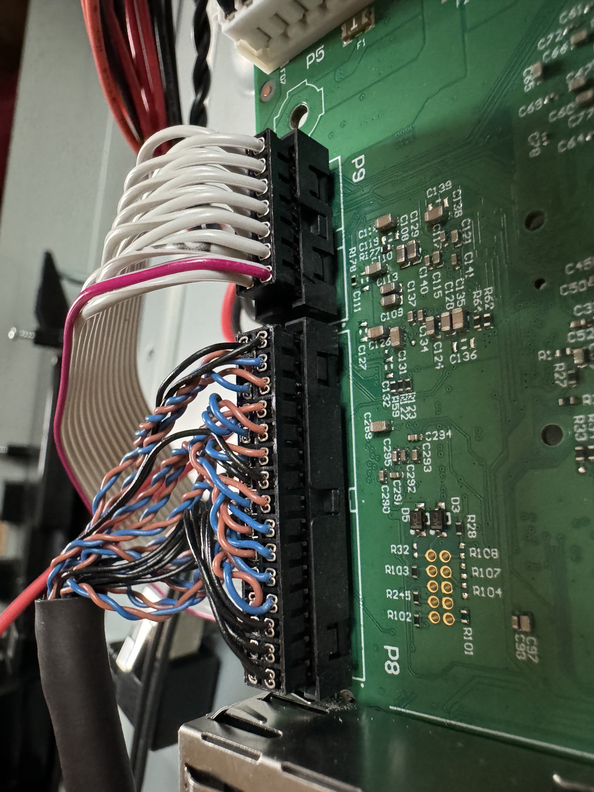
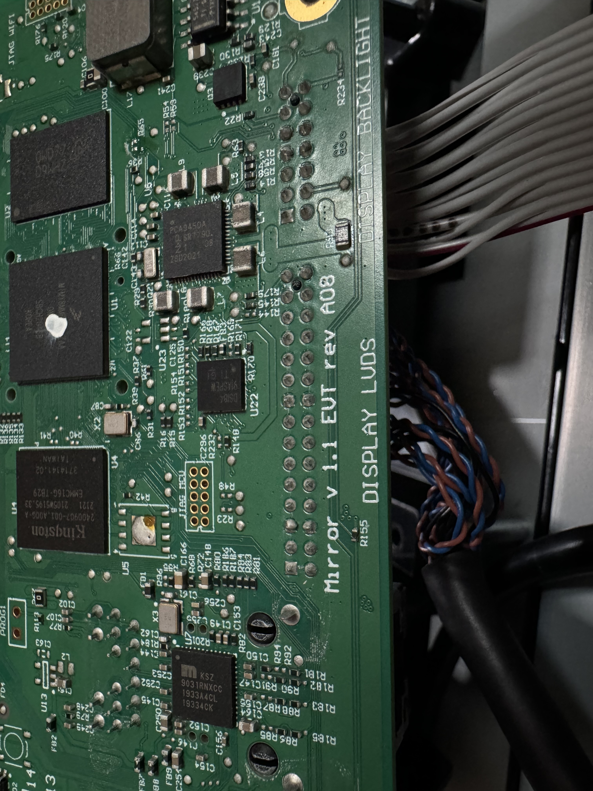

# Creating a Smart Mirror from a Lululemon Mirror
The Lululemon Mirror is a two-way mirror with a display panel behind it, designed for workout videos and was recently [announced](https://www.theverge.com/2023/9/27/23893249/lululemon-mirror-peloton-connected-fitness) as a discontinued product by the company. We wanted to repurpose this hardware to make it a more functional smart mirror. The process has been documented below, with a full tutorial video to demonstrate the steps followed.
      
| MagicMirror | Mainboard | System & Audio | 
|------------|-------------|------------|
|| | |

Note: If you have a newer model Mirror (my unit is Rev08, ordered November 2022), the good news is you may have a BOE display which is the same display used in many TVs from Vizio, ONN and Samsung. This guide is primarily dedicated to that model as it is very easy to place a TV mainboard into the Mirror to display whatever you want.

To check, simply lay down your Mirror, unscrew the base (if used) and four screws on the back side. Lift up the metal case and look for BOE, as shown below where the red circle is:

If your Mirror is a BOE display, read below for the solution we developed. If you have Samsung or any other display, the steps to work with your panel is still a work in progress - see [this](https://github.com/olm3ca/mirror/blob/main/Other%20models.md) for more details.

--------------------------------------------------------------------------------------------------------------------------------------------------------
### Before you begin, 
**By continuing, you acknowledge that you have read and understood the contents of the following disclaimer, and consent to their terms.**

The process described in this document could cause irreversible damage to your Mirror, and you should prepare yourself for that outcome before you begin. I accept absolutely no responsibility for the consequences of anyone choosing to follow or ignore any of the instructions in this document, and make no guarantees about the quality or effectiveness of the software in this repo.

--------------------------------------------------------------------------------------------------------------------------------------------------------

## Table of Contents

- [Project Goals](#project-goals)
- [Hardware Versions](#hardware-versions)
- [Method](#method)
- [Step 1](#step-1)
- [Step 2](#step-2)
- [Step 3](#step-3)

--------------------------------------------------------------------------------------------------------------------------------------------------------

## Project Goals:
The goal is to enhance the Mirror to run other software and to make it a more robust smart mirror. I wanted to use [Magic Mirror](https://magicmirror.builders/) using a small computer inside the Mirror, plus the ability to stream any music and videos that I want to. 

-  43” full HD 1080p IPS display, with 178° wide viewing angle
-  LED Backlight, picture-in-picture functionality
-  The inverter and the power supply can be reused with no modifications
-  The backlight inverter and speakers can be reused to work with the new system 

What we don't need: 
-  Mirror Software: Android-based OS, proprietary launcher. Without any way to jailbreak this system, it isn't very useful to us. 
-  Camera: Unlikely to work post-modification. mipi csi interface, to get that to work for lulu required an entire team of engineers quite a bit of time and consideration in order to get that exactly how they wanted it.
-  The scalar board (with hdmi, usb and the antennas) would require reverse engineering the bios, which is very challenging. It will continue to work for the backlight and other minor functionality only. 

## Hardware Versions
There are several hardware revisions made to the Mirror. 
- Mine is Rev08, ordered November 2022. Photos uploaded to this repo are my own.
- My Panel is a [BOE DV430FHM-NN5](https://www.panelook.com/DV430FHM-NN5_BOE_43_LCM_overview_48245.html) which is the same panel as this [HV430FHB-N10](https://www.panelook.com/HV430FHB-N10_BOE_43_CELL_overview_30568.html). The good news is, this panel is used in several TVs made by Vizio, ONN and Samsung.

Other models of the Mirror have different panels: 

-  Many users have a Samsung LTI400HN01 [full specs](https://www.panelook.com/LTI400HN01_Samsung_40_LCM_parameter_31646.html) and [datasheet](SMSNG41.pdf) connected via LVDS
-  Some users have the [LM40SAMFHD700AG25WV Panel](https://www.panelook.com/LM40SAMFHD700AG25WV-40-TFT-Liquid-Crystal-Display-module-with-LED-Backlight-unit-detail_155306.html) and [datasheet](https://www.panelook.com/upload/product/210800/202302093705.pdf).  This panel is the replacement for [LTI400HN01](https://www.panelook.com/LTI400HN01_Samsung_40_LCM_parameter_31646.html). 
- User r/themiggysmigs provided these photos: https://imgur.com/a/uST7AOL
- RevP1 User r/AYfD6PsXcndUxSfobkM9 photos: https://imgur.com/a/bHYqefX | https://imgur.com/a/3JF6CdK | https://imgur.com/a/gHpoa2T

## Method
What you'll need: A Phillips head screwdriver, TR10 and TR6 screwdrivers, wire cutters, a replacement TV mainboard, and whatever device you want to control the new Mirror (such as a Rasperry Pi, chromecast, a computer, or anything else). 

Watch the full video tutorial here: https://www.youtube.com/watch?v=9asyi3-GeVE

### Step 1  
<table style="padding:10px">
  <tr>
    <td>
      <ul>
        <li>First we have to remove what we don't need.</li>
        <li>Use a Phillips head screwdriver to remove the 4 screws on the back of the Mirror (and the 4 securing the bottom stand, if used)</li>
        <li>Unscrew the scalar board: TR10 - three screws connecting it to the plastic frame from the Mirror. Then, use a TR6 for five screws to remove the board from the plastic shield.</li>
        <li>Disconnect the LVDS from the scalar board and the panel.</li>
        <li>Disconnect the ethernet cable from the scalar board and remove it from the Mirror. We'll use that space below (next to the power insert) for any HDMI and USB cables we want access to instead.</li>
          <li>Disconnect the audio from the scalar board as well. We'll connect them later to the new mainboard's speaker port for audio output.</li>
        </ul> </td>
   <td><video src="https://github.com/olm3ca/mirror/assets/76214954/d0547800-3915-4767-ba37-91380f252c7a" width="300" />
</td>
  </tr>
</table>

### Step 2
<table style="padding:10px">
  <tr>
    <td>
      <ul>
        <li>Now we can start adding the hardware we want.</li>
        <li>If you have a BOE panel, a quick search on eBay for "HV430FHB-N10" (https://bit.ly/420wajv) provides a lot of options for compatible mainboards. Note: you will want a mainboard that comes with LVDS Cable, Ribbon Cables, Power Switch Board and IR Remote if possible. The connector on the tconn board is an ffc, so you need a cable for that.</li>
        <li>I ordered a compatible remote control from Amazon for about $5.</li>
          <li>Add the mainboard panel by securing it to the panel with compatible screws.</li>
        <li>Connect the LVDS cable to the panel.</li>
        <li>If you discarded the camera in the previous step, you can place the IR receiver in that location so a remote control can communicate easily with the panel</li>
       <li>The power button wire can fit through the small reset hole at the top of the Mirror, and you can secure the botton on top of the Mirror.</li> 
        <li>The wifi antena for the new board should be secured to the side of the Mirror for best connectivity.</li>
        <li>Replace the scalar board, it won't fit perfectly due to the size of the IR receiver, but two screws can keep it in place well enough.</li>
        <li>The speakers will work if you use the speaker out port on the mainboard. You can re-use either the Left or Right audio connector from the scalar board, carefully trimming the sides so it will fit the mainboard port. Then, simply merge all of the audio cables so that black, red, orange and blue cables from the two speakers are propertly connected to the corresponding wires leading from the mainboard's speaker port.</li>
        <li>All set - connect power and HDMI to test!</li>
      </ul> </td>
   <td><video src="https://github.com/olm3ca/mirror/assets/76214954/069c2d70-bf43-4219-8a2b-adcdac8a854e" width="300" />
</td>
  </tr>
</table>

### Step 3
<table style="padding:10px">
  <tr>
    <td>
      <ul>
        <li>Finally, add the system you want your Smart Mirror to run.</li>
        <li>If you get a Vizio mainboard like I did, the TV interface will be sideways - it's meant to be a TV, after all. But it's a smart TV with built-in Airplay, Miracast, and other functionality, which is helpful.</li>
        <li>You can run HDMI, USB, and any other cables you need through the old ethernet port area on the bottom of the Mirror.</li>
        <li>One option is to run Magic Mirror (https://magicmirror.builders) on a Raspberry Pi or equivalent device.</li>
        <li>I found a Chromebook for $20 online and compared the specs to a Pi. Removing ChromeOS and putting Linux on it, we gutted the laptop and placed the motherboard, battery and power supply into the Mirror to run Magic Mirror.</li>
          <li>Another option is to connect a computer externally via HDMI.</li>
        <li>Route the cables, connect your system, and you may want to configure power to run through the main port at the base as we did, otherwise you'll have multiple power cords coming out the back of the Mirror.</li>
      </ul> </td>
   <td><video src="https://github.com/olm3ca/mirror/assets/76214954/dfaad6a7-8b25-484b-bdaf-21052e8a832c" width="300" />
</td>
  </tr>
</table>

### Final Notes: 

Many other options are possible with the Mirror. Feel free to place suggestions in the issues section of this repo and I'll add them here. For those who do not have a BOE panel, it would be great to know what ideas you have to make your hardware work too.

For anyone looking to modify the scalar board in other ways beyond what has been accomplished, here are a few images I took of it:

| Scalar Board front | Scalar board LVDS | Scalar board back | 
|------------|-------------|------------|
|| | |

